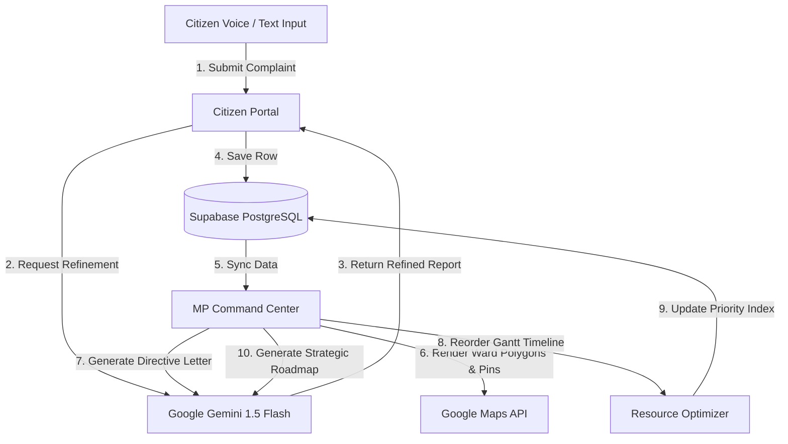

# 🏆 LokDrishti AI — Hackathon Presentation Guide

LokDrishti AI is a fully responsive, state-of-the-art Web GIS and Live AI platform designed for Members of Parliament (MPs) and citizens to optimize local constituency resource management and accelerate grievance redressal.

---

## 📌 Project Overview
* **Live Site URL:** [https://lokdrishti-ai.onrender.com](https://lokdrishti-ai.onrender.com)
* **GitHub Repository:** [SahooShuvranshu/LokDrishti-AI](https://github.com/SahooShuvranshu/LokDrishti-AI)
* **Target Focus:** Citizen Grievance Redressal, Multilingual Accessibility, Live AI Copilot, GIS Spatial Analytics, and Dynamic Project Scheduling.

---

## 🛠️ The Technology Stack

| Layer | Technology | Purpose |
| :--- | :--- | :--- |
| **Frontend Framework** | React (Vite) | Fast-loading, component-driven client interface. |
| **Styling & Theme** | Modern Glassmorphism CSS | Slick, premium dark-mode dashboard with hover micro-animations. |
| **AI Model Engine** | Google Gemini 1.5 Flash API | Performs live dialect translation, metadata extraction, directive letter generation, and strategic resource briefings. |
| **Database** | Supabase PostgreSQL | Live database hosting grievances, project queues, and priority indices. |
| **Authentication** | Supabase Auth (Google OAuth) | Secure login for Members of Parliament and constituency administration staff. |
| **GIS Mapping** | Google Maps JavaScript API | Interactive map centered on Bhubaneswar, Odisha showing geocoded wards, custom markers, and active problem overlays. |
| **Interactive Icons** | Lucide React | Clean, scalable vector interface icons. |
| **State Management** | React Context API | Unified global application context (`AppContext.jsx`) to handle auth status, loading states, and live API configurations. |

---

## 🧠 System Architecture

---

## 💾 Supabase Database Schema

### 1. Grievances Table (`grievances`)
Stores citizen-submitted issues.
* `id` (TEXT, Primary Key): Unique alphanumeric ID (e.g., `LKD-1234`).
* `title` (TEXT): High-level English summary generated by Gemini.
* `reporter` (TEXT): Name of the citizen.
* `description` (TEXT): Raw complaint text (or speech transcription).
* `translated_description` (TEXT): Refined, professional English translation.
* `ward` (TEXT): Assigned geographical ward boundaries.
* `sector` (TEXT): Category (e.g., `Water Supply`, `Sanitation`, `Public Health`, `Infrastructure`).
* `urgency` (TEXT): Severity level (`Low`, `Medium`, `High`, `Critical`).
* `status` (TEXT): Redressal state (`Pending`, `Investigating`, `Resolved`).
* `coordinates` (JSONB): `{x, y}` coordinates mapping to geolocated wards in Bhubaneswar.
* `timestamp` (TIMESTAMPTZ): Submission time.

### 2. Projects Table (`projects`)
Tracks proposed constituency projects funded under the MP Local Area Development (MPLAD) budget.
* `id` (TEXT, Primary Key): Unique project ID (e.g., `PROJ-WO-1234`).
* `name` (TEXT): Name of the development project.
* `sector` (TEXT): Work sector classification.
* `ward` (TEXT): Location target.
* `cost` (NUMERIC): Estimated budget cost in Lakhs.
* `duration` (INTEGER): Completion timeline in days.
* `status` (TEXT): Queue status (`Queued`, `Active`, `Completed`).
* `priority` (INTEGER): Dynamic priority sorting index for the Gantt timeline.
* `materials` (TEXT): Resource specifications.

---

## 💎 Key AI Value Propositions (What to pitch to Judges)

### 1. True Multilingual Inclusivity
* **Voice-First Input:** Uses the Web Speech API to capture speech natively.
* **Gemini Parsing:** Translates vernacular Hindi expressions (e.g., *"पानी बहुत गंदा आ रहा है"*) into formal English, automatically classing the department, estimating impact numbers, and identifying severity without requiring manual sorting.

### 2. Live Municipal Copilot
* **Bureaucracy Automation:** Instantly generates compliance directives from the MP Office directly to municipal bodies (e.g. Municipal Corporation, Central Electricity Authority).
* **strategic Advisory Briefings:** Gathers real-time database inputs and leverages Gemini to write a customized constituency report. The model calculates a live **Constituency Health Score** and recommends budget actions.

### 3. Visual Resource Optimizer
* **Interactive Gantt Timeline:** Organizes project schedules in a drag-and-drop hierarchy.
* **Real-time Cost Cap Constraints:** Enforces strict compliance with the ₹1.0Cr budget threshold limit, instantly prompting alerts if projects exceed safety values.
