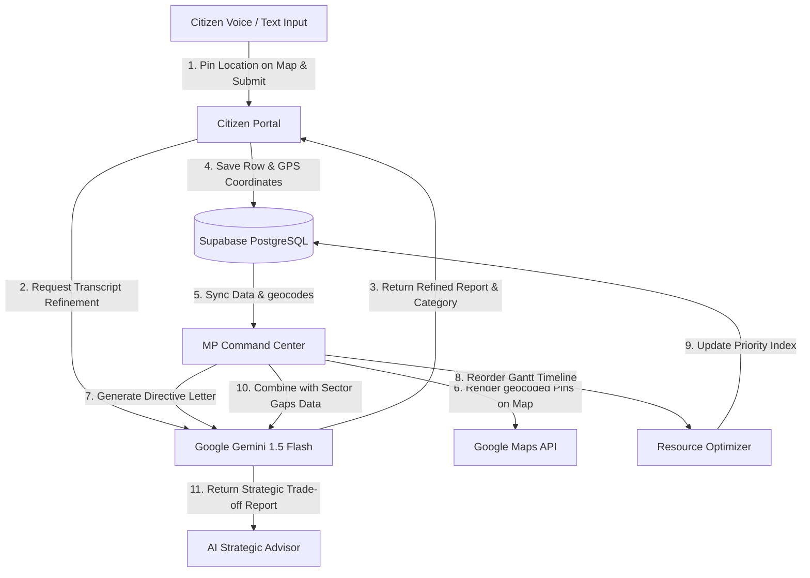

# 🏆 LokDrishti AI — Hackathon Pitch & Presentation Guide

LokDrishti AI is a fully responsive, state-of-the-art Web GIS and Live AI platform designed for Members of Parliament (MPs) and citizens to optimize local constituency resource management and accelerate grievance redressal.

---

## 📌 Project Overview
* **Live Site URL:** [https://lokdrishti-ai.onrender.com](https://lokdrishti-ai.onrender.com)
* **GitHub Repository:** [SahooShuvranshu/LokDrishti-AI](https://github.com/SahooShuvranshu/LokDrishti-AI)
* **Hackathon Track:** People's Priorities (AI for Constituency Development Planning)

---

## 🎙️ The Pitch: How to Explain the Problem & Our Solution to Judges

### 1. The Hook (The Introduction)
> "Judges, as Members of Parliament, managing a constituency of over 10 Lakh citizens with a limited MP Local Area Development (MPLAD) budget of just ₹1 Crore (100 Lakhs) is an optimization nightmare. How do you objectively decide whether to fund a school upgrade in one area versus a vocational training center in another, when citizen complaints arrive in chaotic, unstructured formats?"

### 2. The Problem
* **Unstructured Feedback Chaos:** Citizen requests come via voice notes, handwritten letters, messaging apps, and phone calls. Important requests get lost in administrative static.
* **No Spatial Context:** Wards are large and abstract. Administrators cannot identify specific hot-spots or repeat occurrences.
* **Zero Objective Data Correlation:** There is no tool to compare subjective demands against real demographic stats. For instance, comparing requests for school upgrades (travel-distance data) versus a proposed vocational center (local youth unemployment stats).
* **Budget Tracking Disconnect:** Proposed projects are scheduled ad-hoc, leading to budget overruns beyond the strict ₹1.0Cr cap.

### 3. The LokDrishti AI Solution
We built a unified platform that acts as the **digital nervous system** for a constituency:
* **multilingual & Geocoded Intake:** Citizens speak in their native tongue (like Hindi) and drop a pin on Google Maps. AI translates, structures, and logs the issue at the exact latitude/longitude.
* **Zonal Command Center:** Maps live spatial diagnostics, displaying backlogs and hotspot clusters on a geocoded Bhubaneswar map.
* **AI Strategic Advisor:** Aggregates grievances, correlates them with sector-specific demographic gaps (travel times, enrollment, unemployment rates), and executes Gemini-driven trade-off evaluations.
* **MPLAD Resource Optimizer:** Enforces strict budget caps, allowing administrators to drag-and-drop sort projects and dynamically organize completion schedules on a Gantt timeline.

---

## ⚙️ How the Website Works: Step-by-Step Walkthrough

### Step 1: Citizen Submits Grievance (Citizen Portal)
1. Navigate to the **Citizen Portal** tab.
2. The citizen clicks **Record Voice** and speaks in Hindi or English (e.g., *"Hamaare area mein paani ke pipe se ganda paani aa raha hai"*).
3. The platform leverages the HTML5 Speech Recognition API to transcribe the dialect.
4. The transcription is sent to **Google Gemini 1.5 Flash**. Gemini translates the Indic dialect, structures it into a professional English title, predicts the sector category (*Water Supply*), and sets the severity level (*Critical*).
5. The citizen types an address (e.g. *"Jayadev Vihar"*) or clicks **Share Live Location** to fetch their current GPS coordinates. They can drag the red pin on the Google Map to fine-tune the exact location.
6. Click **Submit Grievance**. The row is instantly inserted into the live Supabase PostgreSQL database.

### Step 2: Administrator Authenticates (Login Gate)
1. Navigate to the **Command Center** tab.
2. The administrator is prompted by a secure Google OAuth sign-in screen.
3. Signing in redirects the administrator back, reading the session using the Supabase Auth listener, and unlocking the Command Center.

### Step 3: Incident Diagnostic Auditing (Grievance Command Panel)
1. The dashboard fetches active grievances from Supabase.
2. The geocoded pins are rendered on the **Google Map** centered on Bhubaneswar, colored by severity (Red = Critical, Yellow = Medium, Green = Low).
3. Clicking a pin opens the **Inspector Panel**:
   - Inspect the AI translation side-by-side with the raw voice text.
   - Click **Generate AI Directive**. Gemini drafts a context-aware municipal notice (e.g., to the Bhubaneswar Water Board) and an SMS update for the reporter.
   - Click **Create Work Order** to export the grievance as an active development project.

### Step 4: Budget Compliance & Gantt Scheduling (Resource Optimizer)
1. Navigate to the **Resource Optimizer** sub-tab.
2. The list of active projects is displayed as drag-and-drop cards showing estimated costs, durations, and materials.
3. The top banner shows the budget utilization bar: if total costs exceed the **₹1.0Cr (100 Lakhs) MPLAD cap**, the indicator flashes red and displays a warning.
4. Dragging cards changes their sequence order. This instantly triggers a batch `upsert` saving the new priority order to Supabase.
5. The Gantt chart dynamically draws start and end dates sequentially based on the priority index, ensuring projects are scheduled logically.

### Step 5: Demographic Trade-off Advisory (AI Strategic Advisor)
1. Navigate to the **AI Strategic Advisor** sub-tab.
2. Click **Generate AI Strategic Roadmap**.
3. The advisor scans active database rows and passes them to Gemini alongside public sector demographics (e.g. *Education Sector: 94% enrollment, 4.5km travel-to-school distance* vs *Vocational Training Sector: 18% youth unemployment*).
4. Gemini runs a comparative trade-off analysis, determining whether to prioritize school upgrades or vocational centers based on local census gaps, and prints a formatted briefing roadmap.

---

## 🛠️ Detailed Tech Stack & Frameworks

### 1. Core Framework: React 19 & Vite
* **Why Vite:** Offers instant hot module replacement (HMR) and ultra-fast ESbuild transpilation, ensuring smooth UI state switches.
* **State Management:** Unified global React Context (`AppContext.jsx`) managing auth sessions, map scripts loading, and Supabase database records synchronization.

### 2. Styling System: Custom Modern CSS (Glassmorphism)
* **Visuals:** Dark mode layout utilizing deep zinc gradients, transparent glassmorphism panels, customizable border systems, and smooth hover micro-animations.
* **Fonts:** Loaded Google Fonts *Outfit* (for bold, editorial headings) and *Inter* (for clean, readable metadata tables).

### 3. AI Model Engine: Google Gemini 1.5 Flash API
* **Indic Translation:** Translates and refines messy voice transcripts.
* **Multimodal Reasoning:** Synthesizes directive letters and municipal notices based on geocoded categories.
* **Trade-Off Analytics:** Compares demographic indicators (school travel-distances vs. local unemployment rates) to calculate project rankings.

### 4. Database: Supabase PostgreSQL
* **CRUD Syncing:** Real-time database syncing. Inserting, updating, or deleting records on the frontend writes updates directly to PostgreSQL.
* **Geocoding Support:** Leverages JSONB formatting to store precise geographical coordinate pairs (`{lat, lng}`) for spatial mapping.

### 5. Authentication: Supabase Auth (Google OAuth)
* **Single Sign-On:** Protects command panels using Google OAuth redirection, ensuring secure login credentials and profile picture display.

### 6. Interactive GIS: Google Maps JavaScript SDK
* **Spatial Mapping:** Embedded map centered on Bhubaneswar. Renders custom pins representing geocoded grievance coordinates.
* **Address Geocoder:** Utilizes core Geocoding services to resolve typed landmark queries to precise coordinate coordinates.

### 7. Analytical Charts: Apache ECharts & ReactECharts
* **Data Visualization:** Theme-aware, vector-drawn horizontal bars (grievance categories), donuts (budget allocations), and sparklines (constituent satisfaction rates).
